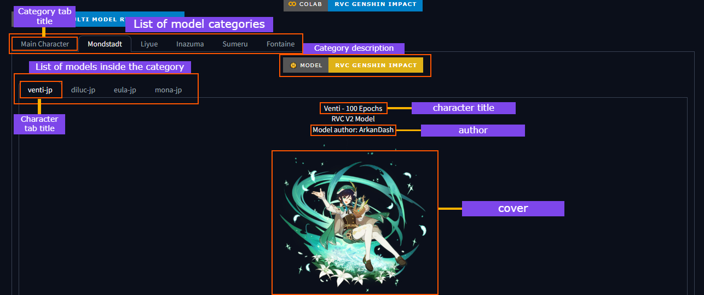

## How to use?

### Simple

1. Delete the all file and folder inside the weights folder
2. Put all your model inside weights

```
rvc-inference/
├─ weights/
│  ├─ [your model folder #1]/ (Put your pth and index file here)
│  ├─ [your model folder #2]/ (Put your pth and index file here)
│  ├─ ...other model
├─ ...other stuff
```
4. Done

Note: Custom character/model name, image file and author may not be available for this.

### Advanced Only

This method is only for advanced user only.
1. Create folder_info.json inside weights and 
create a category folder that contains list of character model.

```
rvc-inference/
├─ weights/
│  ├─ genshin impact/
│  ├─ folder_info.json
├─ ...other stuff
```

2. Inside folder_info.json
```json
"CATEGORY_TAB_NAME":{
    "enable": true,
    "title": "CATEGORY_TITLE",
    "folder_path": "CATEGORY_FOLDER_PATH",
    "description": "CATEGORY_DESCRIPTION"
}
```

folder_info.json info:
- CATEGORY_TAB_NAME = an category tab name (this one is just a name without spaces, but it wont affect the ui category title) [Required]
- enable = Enabled/Disabled cat [Required]
- title = Title of the category (this one affect the ui category title) [Required]
- folder_path = folder path to the category folder (ex. Genshin Impact) [Required]
- description = Description below the selected tab [Optional]

3. Create model_info.json inside the category folder 

```
rvc-inference/
├─ weights/
│  ├─ genshin impact/
│  │  ├─ model_info.json
│  ├─ folder_info.json
├─ ...other stuff
```
4. Inside model_info.json (If you have more than one model just duplicate and change the value)
```json
"FOLDER_PATH": {
    "enable": true,
    "model_path": "CHARACTER_BASEMODEL",
    "title": "CHARACTER_NAME",
    "cover": "CHARACTER_IMAGE",
    "feature_retrieval_library": "CHARACTER_MODEL_INDEX",
    "author": "MODEL_AUTHOR"
}
```
model_info.json info:
- FOLDER_PATH = folder path to the model [Required]
- enable = Enabled/Disabled model [Required]
- model_path = path to model file (ex. "venti.pth") [Required + must shown the extension]
- title = Title of the character/model (this one affect the ui category title) [Required + must shown the extension]
- cover = folder path to the image file (ex. "image.png") [Optional + must shown the extension]
- feature_retrieval_library = path to index file (ex. "added_IVF4198_Flat_nprobe_1_zhongli-jp_v2.index") [Required]
- author = Author of the model [Optional]

1. Put your desired model to your category folder
Example:
```
rvc-inference/
├─ weights/
│  ├─ genshin impact/
│  │  ├─ [your model folder #1]/ (Put your pth and index file here)
│  │  ├─ [your model folder #2]/ (Put your pth and index file here)
│  │  ├─ ...other model
│  │  ├─ model_info.json
│  ├─ folder_info.json
├─ ...other stuff
```
1. Done.

Note:
- To add image to the ui just put your image into the model folder and setting up the image path in the folder info.json.

More detail stuff:
